

<h1>ErjcmPack使用指南（主要内容）<h1>

## 目录
- [目录](#目录)
  - [普遍适用的操作](#普遍适用的操作)
  - [中国铁路站台显示屏1](#中国铁路站台显示屏1)

### 普遍适用的操作
1. 下载所需要的`ErjcmPack`发行版。  
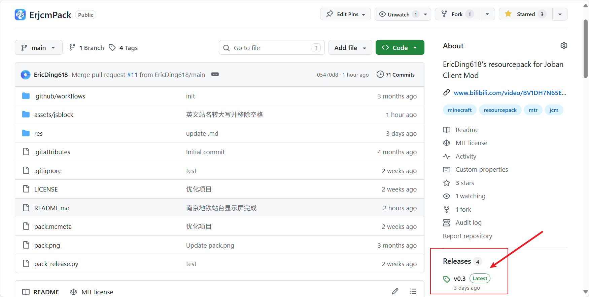
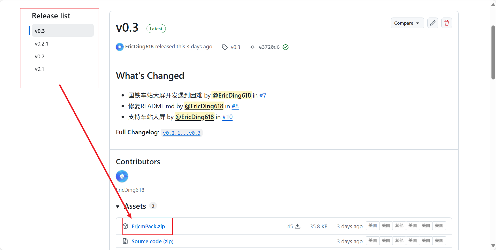
2. 等待下载完成，打开下载文件夹。  
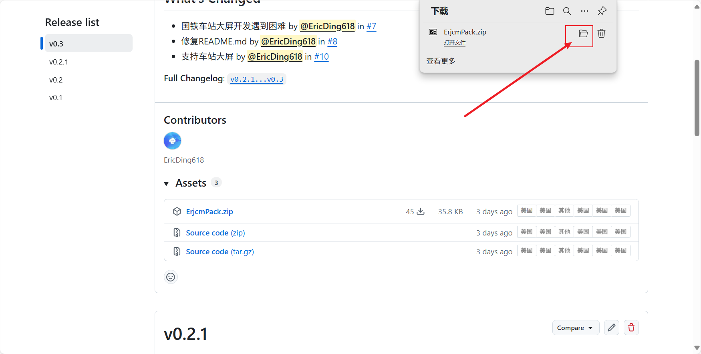
3. 回到游戏中，将其导入至游戏内部。
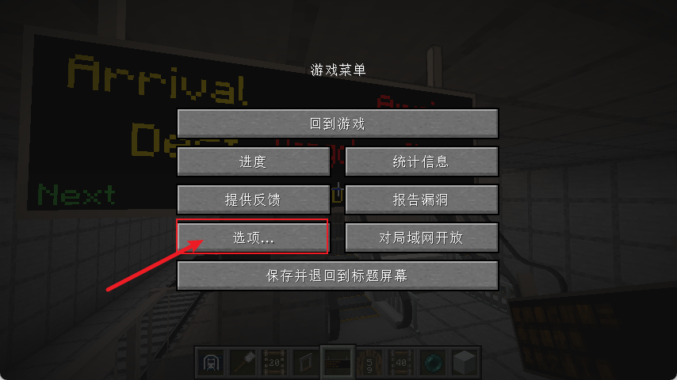
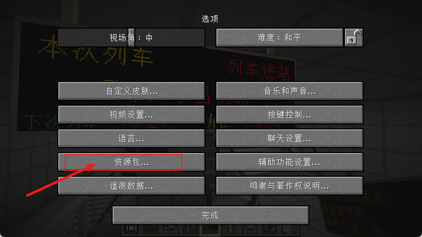
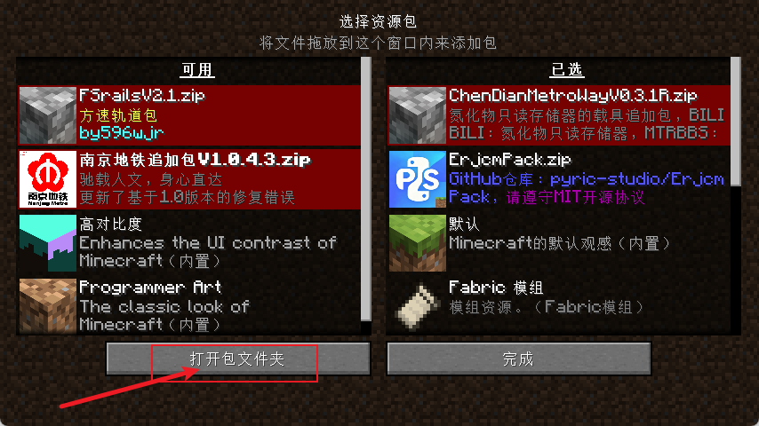
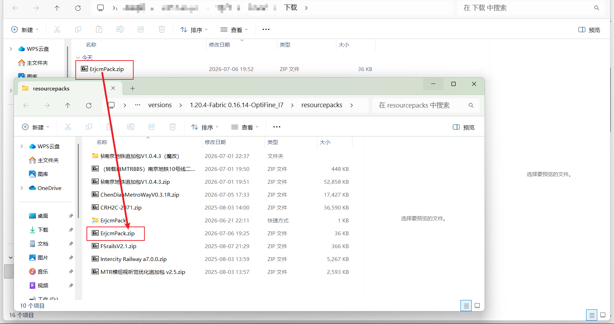
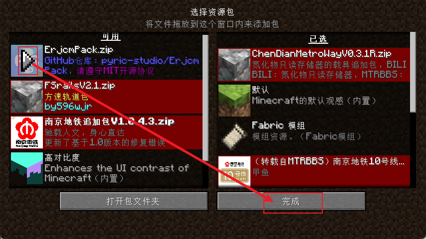

> [!WARNING]
> 如遇不显示车次的情况，请检查是否填入号码！
> 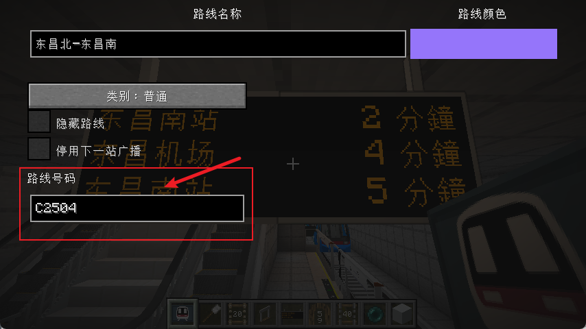

***针对显示屏类**  
4. 使用MTR的`刷`右键JCM的`乘客资讯显示屏`。
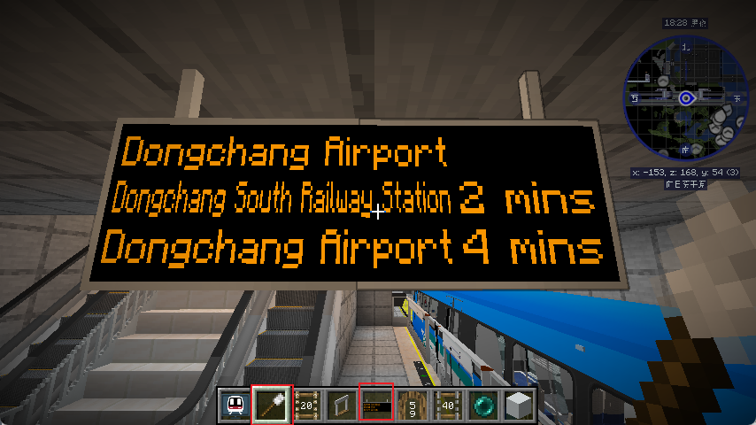
5. 配置格式。
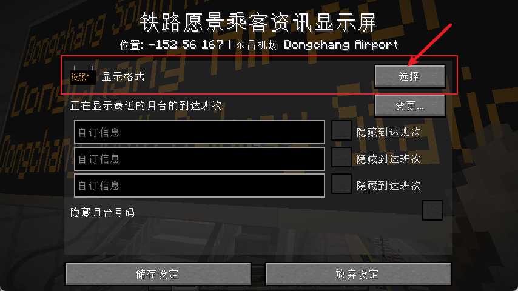
（选择其中之一）
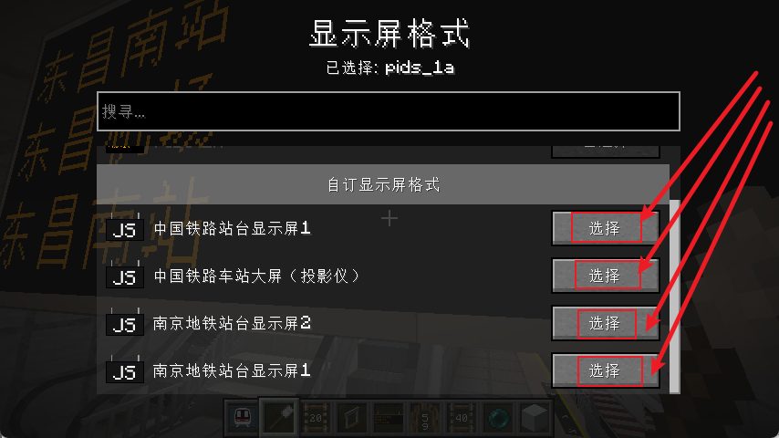
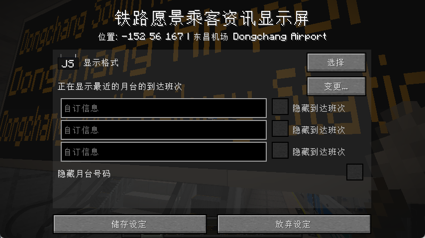

***针对投影仪类**  
4. 
### 中国铁路站台显示屏1
